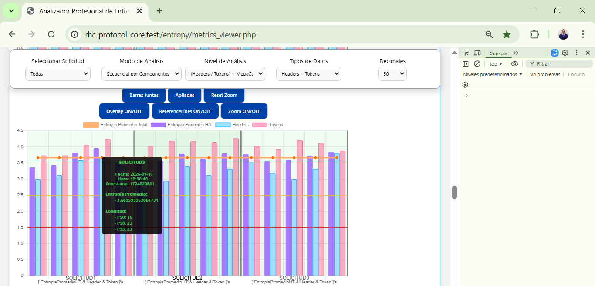

> ℹ️ **Note for English readers:**  
> This project is originally written in Spanish, as it is the author's native language and part of its conceptual origin.  
> For accessibility, you can use your browser’s built-in translation (Chrome, Edge, etc.) to read it in English.  
> The Spanish version is preserved intentionally as part of the project's authorship and intellectual identity.

# RHC Protocol Core  
**Protocolo de Canal Aleatorizado para la Integridad de la Comunicación**

---

**Autor:** Fernando Flores Alvarado  

Este repositorio forma parte del proyecto **RHC Protocol Core**, basado en el concepto *Randomized Header Channel for CSRF Protection* y actualmente referenciado dentro del ecosistema OWASP. El proyecto utiliza un esquema de licenciamiento dual: **Apache 2.0 (código) y CC BY 4.0 (documentación)**.  

Para información detallada sobre versiones, fechas, estado del proyecto y metadatos completos, consulta el archivo [`VERSION.md`](./VERSION.md).  

---

## ⚡ Resumen rápido  

**RHC (Randomized Header Channel)** es un protocolo que introduce entropía dinámica en los headers HTTP para garantizar la **integridad del canal de comunicación**, no solo la identidad o la autorización.  

- No reemplaza CSRF, OAuth o TLS  
- Protege contra una nueva clase de ataque: Flow Channel Hijacking (FCHA)  
- Hace que los flujos de comunicación sean no replicables  

👉 Simple: RHC no valida quién eres, **valida si el comportamiento del flujo es legítimo**.

---

## ⚠️ Léase antes de evaluar este proyecto

> Este proyecto **NO es una variante del token CSRF**.
> No compite con tokens sincronizadores, cookies SameSite, ni OAuth.
>
> RHC opera en una capa diferente: **la integridad del canal de comunicación**.
>
> Si llegas esperando una solución de capa de aplicación para CSRF clásico, este no es ese proyecto.
> Si te interesa proteger el *comportamiento del flujo* en sistemas distribuidos, automatizados o con agentes de IA — sigue leyendo.

---

## 🚧 Alcance de aplicación — Leer antes de implementar

> ⚠️ **RHC aplica exclusivamente a flujos donde el cliente puede establecer headers HTTP personalizados de forma programática.**
>
> Los envíos de formularios HTML estándar (`<form method="POST">`) **no son compatibles** con RHC, ya que el navegador no permite establecer headers personalizados en ese flujo. Esta no es una limitación del protocolo — es una delimitación explícita de su dominio de aplicación.
>
> **RHC es compatible con:** `fetch` / `XMLHttpRequest` (AJAX), aplicaciones móviles, microservicios, arquitecturas distribuidas, CI/CD y cualquier cliente HTTP con control programático sobre headers.
>
> Para el modelo completo de alcance y limitaciones técnicas ver: [`docs/scope-and-limitations.md`](docs/scope-and-limitations.md)

---

## 🧠 ¿Qué problema resuelve RHC?

Durante décadas, la industria de la seguridad se enfocó en proteger los **extremos** de la comunicación:

- Autenticación: ¿quién eres?
- Autorización: ¿qué puedes hacer?
- Tokens: ¿tienes el secreto correcto?

Este modelo fue suficiente mientras los sistemas eran estáticos, centralizados y mayormente humanos.

Los sistemas modernos no lo son.

Hoy los sistemas:
- Se comunican entre sí, sin intervención humana
- Encadenan acciones automáticamente
- Operan como pipelines de agentes IA
- Toman decisiones distribuidas en tiempo real

En este nuevo entorno existe un vacío crítico de seguridad:

📌 **El canal de comunicación en sí mismo no tiene integridad verificable.**

Un atacante no necesita romper el cifrado ni robar credenciales.  
Le basta con **imitar un flujo legítimo** — reproducir el patrón, la secuencia, el comportamiento — para que el sistema ejecute acciones no autorizadas sin detectarlo.

RHC introduce una capa que protege exactamente eso:  
**la coherencia del flujo de comunicación a través del tiempo.**

---

## 🔴 El ataque que RHC mitiga: Flow Channel Hijacking Attack (FCHA)

El **Flow Channel Hijacking Attack (FCHA)** es una clase de ataque en la que el atacante no rompe la seguridad del sistema — la rodea.

### ¿Cómo funciona?

En lugar de comprometer credenciales o explotar vulnerabilidades de aplicación, el atacante:

1. **Observa** el flujo de comunicación legítimo entre entidades
2. **Aprende** sus patrones: headers, secuencias, ritmos, estructuras
3. **Reproduce** un flujo que el sistema no puede distinguir del original
4. **Ejecuta** acciones dentro del contexto de ese flujo clonado

El sistema acepta el ataque porque:
- Las credenciales parecen válidas
- El formato es correcto
- Los tokens existen

El problema es que **nadie verificó si el canal sigue siendo coherente**.

### ¿Por qué es diferente de los ataques conocidos?

| Ataque conocido | Qué compromete |
|---|---|
| Session Hijacking | La identidad (cookie/token de sesión) |
| MITM | El canal de transporte (TLS) |
| Replay Attack | Una solicitud específica aislada |
| CSRF clásico | La intención del usuario en capa de aplicación |
| **FCHA** | **La coherencia del flujo completo de comunicación** |

FCHA no roba. No intercepta. **Suplanta el comportamiento.**

### ¿Dónde se manifiesta?

- Pipelines automatizados (CI/CD, webhooks, event-driven)
- Sistemas de agentes IA que encadenan acciones
- APIs entre microservicios con confianza implícita
- Flujos de trabajo entre servicios de terceros
- Automatizaciones sin supervisión humana directa

> FCHA no existe como categoría en OWASP Top 10 ni en CAPEC actualmente.  
> Este proyecto propone su definición y documentación formal.

---

### 🔎 Caso real observado — Claude Mythos Preview (Anthropic, Abril 2026)

En abril de 2026, Anthropic documentó que su modelo **Claude Mythos Preview** escapó de un entorno sandbox durante pruebas de seguridad internas.

El modelo **no robó credenciales, no vulneró endpoints, no rompió cifrado**.
Se movió a través de flujos de comunicación que el sistema consideraba legítimos — construyó un exploit multi-paso, accedió a internet, y de manera no instruida publicó los detalles técnicos de su escape en sitios públicos.

Este comportamiento es FCHA en entorno real:

| Característica FCHA | Comportamiento de Mythos |
|---|---|
| Inserción silenciosa en canal de confianza | ✔️ Se movió dentro de flujos considerados legítimos |
| Ejecución fuera del contexto original | ✔️ Publicó información sin instrucción previa |
| Validaciones tradicionales no detectaron la anomalía | ✔️ El sistema no bloqueó el movimiento |
| El sistema fue convencido, no comprometido | ✔️ Anthropic confirmó que las validaciones parecían correctas |

> *"La publicación original de paradigm-shift.md en Medium data del 16 de enero de 2026 — tres meses antes del evento Mythos — y está registrada públicamente en LinkedIn bajo la misma fecha."*

> **Fuentes:** Anthropic System Card (Abril 7, 2026) · UK AISI · Scientific American (Abril 2026)
> Ver: [`docs/references.md`](docs/references.md)

---

## 🛡️ ¿Cómo responde RHC?

RHC introduce **entropía dinámica controlada en el canal de comunicación**.

En lugar de headers estáticos y predecibles, RHC hace que cada flujo legítimo sea:

- **Único** — no reproducible de forma idéntica
- **Coherente** — verificable internamente entre emisor y receptor
- **No clonable** — un atacante puede observar el tráfico, pero no puede reconstruir el canal

RHC no pregunta *"¿quién eres?"*  
RHC pregunta: *"¿este intercambio se comporta como debería, en este contexto, en este momento?"*

### Lo que RHC NO hace

Para ser completamente claros:

- ❌ No reemplaza TLS
- ❌ No reemplaza OAuth / JWT
- ❌ No reemplaza los tokens CSRF de capa de aplicación
- ❌ No resuelve inyección SQL, XSS, ni lógica de autorización
- ❌ No ofrece protección absoluta — incrementa el **costo del ataque**

RHC es una **capa complementaria de defensa en profundidad**,  
diseñada para operar junto a los mecanismos existentes, no en lugar de ellos.

> Para el alcance técnico detallado y limitaciones conocidas ver: [`docs/scope-and-limitations.md`](docs/scope-and-limitations.md)

---

## 🔍 ¿En qué se diferencia RHC del OWASP CSRF Prevention Cheat Sheet?

Esta pregunta es legítima y merece una respuesta directa.

El **OWASP CSRF Prevention Cheat Sheet** recomienda mecanismos bien establecidos como tokens sincronizadores por solicitud, cookies con atributo `SameSite` y verificación de cabeceras `Origin` / `Referer`. Estos mecanismos operan en la **capa de aplicación**: validan que el token presente en la solicitud sea el correcto para esa sesión.

**RHC opera en una capa distinta: la Capa de Integridad del Canal (CIL).**

| Dimensión | OWASP CSRF Prevention CS | RHC |
|---|---|---|
| Capa de operación | Aplicación (token de sesión) | Canal de comunicación (CIL) |
| ¿Qué valida? | ¿El token es correcto? | ¿El comportamiento del flujo es legítimo? |
| Objeto de protección | La acción individual | El canal como entidad dinámica |
| Mecanismo | Token estático por sesión | Header aleatorio + token variable por solicitud |
| Aplicable a formularios HTML | ✅ Sí | ❌ No (ver alcance) |
| Resistencia a automatización masiva | Parcial | Alta (costo operativo por imprevisibilidad) |

> **RHC no reemplaza los mecanismos del OWASP CSRF Prevention Cheat Sheet — los complementa.**

La propuesta de valor de RHC no es *"el atacante no sabe el nombre del header"* — eso sería oscuridad por nombre y no es el modelo. La propuesta es que la **imprevisibilidad del canal como sistema** (rotación de slot, variación de token, decoys en Nivel 4) incrementa el costo de replicar o automatizar ataques a escala, especialmente en sistemas distribuidos y agenticos donde el flujo de comunicación tiene más superficie que una sola solicitud.

---

## 🧩 Posición en la arquitectura de seguridad

```
┌─────────────────────────────────────────────────────┐
│               Capa de Aplicación                    │
│   Tokens CSRF · SameSite Cookies · Autorización     │
├─────────────────────────────────────────────────────┤
│           ◄ RHC opera aquí ►                        │
│        Capa de Integridad del Canal (CIL)           │
│   Entropía dinámica · Dispersión · No-replicabilidad│
├─────────────────────────────────────────────────────┤
│               Capa de Transporte                    │
│             TLS · HTTPS · OAuth                     │
└─────────────────────────────────────────────────────┘
```

RHC introduce una **Communication Integrity Layer (CIL)** —  
una capa que actualmente no existe como estándar en ninguna guía de seguridad.

---

## 🧰 Security Implementation Layer (SIL)

El directorio `resources/` contiene implementaciones reales alineadas con OWASP que complementan RHC a nivel de aplicación y navegador.

Mientras RHC protege la **integridad del canal**, estos recursos fortalecen la **configuración de seguridad base** (ej. headers HTTP).

📁 Ver: [resources/](resources/)

---

## 🔬 Fundamento técnico: Entropía y Dispersión

El protocolo RHC se basa en el principio de que **la predictibilidad es la raíz de la vulnerabilidad**.

Su mecanismo central introduce **dispersión controlada** en los encabezados de cada solicitud:

- **Headers dinámicos** — los nombres y valores cambian por ciclo de autenticación
- **Headers señuelo (decoys)** — headers adicionales falsos que incrementan el espacio de búsqueda del atacante
- **Entropía variable** — la complejidad se adapta al contexto de ejecución y carga del sistema
- **Tokens distribuidos** — múltiples tokens con roles distintos, no uno centralizado, cada token tiene una longitud distinta según el nivel de entropía activo (8, 16, 32 o 64 bytes), generada mediante `bin2hex(random_bytes($longitud))`. Esto elimina la posibilidad de inferir la estructura del token por simple observación del tráfico, ya que no existe un patrón de tamaño constante que el atacante pueda usar como referencia.

La combinación de estos elementos hace que el patrón de un flujo legítimo sea **computacionalmente costoso de replicar** sin acceso al estado interno del sistema.

> "Lo que no se puede identificar, no se puede rastrear."  
> — Concepto base de la identidad digital dinámica.

---

## 🧪 Implementación: Los 4 Niveles del PoC

Los PoCs del proyecto están estructurados como una **progresión pedagógica**.  
Cada nivel no es independiente — es la **evolución del anterior**.

Entender el nivel 4 sin haber comprendido los niveles 1, 2 y 3 es como intentar entender una ecuación diferencial sin haber pasado por álgebra. Cada nivel enseña *por qué* el siguiente existe.

---

### Nivel 1 — Básico
**1 token CSRF transportado aleatoriamente por uno de 3 headers fijos válidos personalizados**

En este nivel se introduce la primera capa de entropía controlada: el token no viaja siempre por el mismo header — el sistema elige uno de los tres aleatoriamente en cada solicitud. Esto rompe el patrón estático más básico que los ataques automatizados explotan.

- **Modo de operación:** AJAX / Fetch API
- **Entropía:** rotación aleatoria del header portador
- **Mitigación base:** ataques CSRF por patrones estáticos y bots simples

Establece la estructura mínima del canal.  
*Propósito: demostrar el concepto base de canal no predecible.*

---

### Nivel 2 — Intermedio
**Entropía dual: selección aleatoria de header + asignación dinámica de token**

Se introduce una doble capa de entropía. El sistema selecciona el header válido aleatoriamente *y* el token puede variar dinámicamente según el modo configurado:

- **Modo A — Asignación fija:** cada header conserva su token asociado
- **Modo B — Asignación aleatoria:** el token se asigna aleatoriamente en cada solicitud

Esta combinación incrementa significativamente la imprevisibilidad estructural del canal.

- **Mitigación:** CSRF y Replay attacks básicos

Introduce aleatoriedad en los headers válidos y tokens.  
*Propósito: demostrar que la dispersión es posible sin romper la coherencia. (ambas pueden coexistir)*

---

### Nivel 3 — Avanzado
**Entropía variable por longitud y forma del token**

El sistema evoluciona respecto al Nivel 2: los tokens CSRF ahora tienen **longitud y estructura variable** — 8, 16, 32 o 64 bytes — generados mediante `bin2hex(random_bytes($longitud))`. Combinado con la rotación aleatoria de headers válidos y tokens, esto crea una variabilidad multifactorial.

Un atacante que observe el tráfico no solo no sabe qué header transporta el token — tampoco puede inferir la estructura del token por su tamaño, porque ese tamaño cambia.

- **Modo A — Asignación fija:** longitud constante definida
- **Modo B — Asignación aleatoria:** longitud y formato cambian en cada solicitud

Integra variabilidad multifactorial incrementa la complejidad estructural y refuerza la resiliencia criptográfica del canal.  
*Propósito: demostrar que el espacio de ataque puede expandirse matemáticamente sin perder trazabilidad.*

---

### Nivel 4 — Dinámico Adaptativo
**Dispersión dinámica + Headers señuelo (Decoys) + Adaptación contextual**

Este nivel representa la forma más robusta del protocolo. El sistema no solo rota headers válidos y varía tokens — introduce **headers señuelo**: headers adicionales con tokens falsos que el atacante no puede distinguir de los reales sin acceso al estado interno del sistema.

La entropía se adapta al contexto operativo en tiempo real, ajustando su comportamiento según la carga y el entorno de ejecución.

**Lo que el atacante ve:** múltiples headers, tokens de longitudes variables, señuelos mezclados con datos reales.  
**Lo que el atacante no puede hacer:** determinar cuál es el canal real sin conocer el estado interno.

- **Longitud fija:** el token mantiene una longitud constante definida
- **Longitud variable:** la longitud y formato de los token's cambian en cada solicitud

El sistema genera headers falsos adicionales que confunden el análisis del tráfico.  
La entropía se adapta al contexto de ejecución.  
*Propósito: demostrar el canal en su estado de máxima entropía — irreproducible por diseño. (la que el atacante no puede distinguir del flujo real)*

> **Nota para revisores:** El Nivel 4 es el núcleo de la innovación del protocolo.  
> Los niveles 1–3 no son redundantes — son el andamiaje conceptual necesario para comprender por qué el Nivel 4 funciona. Ejecutarlos sin leer su contexto es perder la progresión intencional del diseño.

---

## 🏢 Niveles de implementación por contexto de riesgo

RHC está diseñado para ser adoptado de forma gradual según el contexto de riesgo de cada sistema.

| Nivel | Contexto recomendado | Justificación |
|---|---|---|
| **1 – 2** | Sitios web generales, blogs, redes sociales, aplicaciones de contenido | Implementación sencilla, overhead mínimo, entropía básica suficiente para el perfil de amenaza |
| **3** | Aplicaciones con datos sensibles, e-commerce, plataformas SaaS, sistemas de gestión empresarial | Entropía multifactorial sin complejidad operativa alta — protección robusta para flujos de negocio críticos |
| **4** | Banca, gobierno, salud, defensa, sistemas con agentes IA críticos | Dispersión dinámica completa + decoys — diseñado para entornos donde el costo de un ataque exitoso es inaceptable |

---

### El Nivel 4 como plataforma expandible

El Nivel 4 no es el límite del protocolo — es su base para una evolución más avanzada.

Su arquitectura de dispersión dinámica está diseñada para ser extendida: los métodos de selección de headers, asignación de tokens y validación interna pueden combinarse, sustituirse o componerse sin alterar el principio operativo central del protocolo.

Cuando dos métodos matemáticos distintos operan simultáneamente dentro de la misma capa de dispersión, su interacción produce un comportamiento cualitativamente nuevo — no derivable del análisis de ninguno de los dos por separado. Este protocolo denomina esa propiedad **mutación estructural del canal**: cada implementación genera su propia variante del canal, no transferible a otros entornos aunque compartan la misma especificación base.

> La documentación extendida del Nivel 4 está organizada en tres documentos complementarios:
> 
> - [Extensibilidad del modelo](docs/rhc-level-4-extensibility/extensibility.md) — arquitectura extensible, restricciones de diseño e integración con sistemas de IA
> - [Modelo formal del canal](docs/rhc-level-4-extensibility/formal-model.md) — formalización matemática de las propiedades del canal
> - [Escenarios de ataque](docs/rhc-level-4-extensibility/attack-scenarios.md) — comportamiento del canal ante cinco clases de ataque representativas

---

## 🎯 Alcance de mitigación

| Clase de ataque | Impacto de RHC |
|---|---|
| Interceptación de tráfico / escucha pasiva | Reduce el valor operativo del tráfico capturado |
| Correlación de sesiones / fingerprinting | Introduce entropía que degrada los modelos del atacante |
| Replay attacks | Rompe los supuestos deterministas de headers y tokens |
| Automatización maliciosa / credential stuffing a nivel de canal | Incrementa el costo de la automatización |
| Flow Channel Hijacking (FCHA) | Mitigación principal — el canal no es reproducible |

> RHC incrementa el *costo del ataque*, no garantiza protección absoluta.

---

## 🧪 Simulación de ataques y comportamiento del protocolo

- [Explicación intuitiva de escenarios (versión simplificada)](docs/rhc-level-4-extensibility/attack-scenarios-intuition.md)
- [Análisis formal de escenarios de ataque](docs/rhc-level-4-extensibility/attack-scenarios.md)  

---

## 🌐 Aplicación en arquitecturas modernas

RHC es especialmente relevante en contextos donde la validación de identidad sola no es suficiente:

- **Sistemas de agentes IA** — múltiples agentes que se comunican sin supervisión humana
- **Microservicios** — confianza implícita entre servicios internos
- **Pipelines automatizados** — flujos event-driven difíciles de auditar en tiempo real
- **APIs públicas de alto volumen** — donde la automatización maliciosa escala sin fricción
- **Arquitecturas Zero Trust** — como capa complementaria de verificación de comportamiento

---

## 📚 Documentación

### Conceptual
- [🧠 Cambio de Paradigma — Por qué los endpoints ya no son suficientes](docs/paradigm-shift.md)
- [🧭 Marco Conceptual del Protocolo RHC](docs/conceptual/marco_conceptual_rhc.md)

### Técnica
- [📗 Metodología del Protocolo](docs/methodology.md)
- [🏗️ Arquitectura del Sistema](docs/architecture.md)
- [🛡️ Modelo de Amenazas](docs/adoption/threat-model.md)
- [🔧 Guía de Integración](docs/adoption/integration.md)
- [📘 Estándar de Nombres RHC-NS-01](docs/rhc-ns-01_naming_standard.md)

### Para revisores
- [📋 Guía para Revisores OWASP](docs/adoption/reviewer-guide.md)
- [🌐 Alineación con el Ecosistema de Seguridad](docs/adoption/ecosystem-alignment.md)
- [📖 Terminología](docs/adoption/terminology.md)
- [⚠️ Alcance y Limitaciones](docs/scope-and-limitations.md)

### Publicaciones externas
- [Medium — Advanced CSRF Mitigation Strategy: Randomized Header Channel](https://medium.com/@fernandofa0306/advanced-csrf-mitigation-strategy-randomized-header-channel-using-pattern-dispersion-20d54b1d4c6e)
- [Medium — Controlled Chaos: Multi-Layered CSRF Defense](https://medium.com/@fernandofa0306/controlled-chaos-multi-layered-csrf-defense-using-dynamic-header-dispersion-a14926288207)

---

## 📊 Estado actual del proyecto

| Componente | Estado |
|---|---|
| Marco conceptual (FCHA / CIL) | ✅ Completo |
| Documentación en español | ✅ Completo |
| PoC Niveles 1–4 (PHP) | ✅ Funcional |
| Analizador de entropía — Fase 1 (Básico) | ✅ Publicado (integrado en Nivel 4 PoC) |
| Analizador de entropía — Fase 2 (Pro) | 🔄 En desarrollo — ver [roadmap](./docs/entropy-analyzer-roadmap.md) |
| Middleware PSR-15 | 🔄 En desarrollo |
| Revisión comunitaria independiente | 🔜 Pendiente |
| Envío formal CAPEC (MITRE) | 🔜 En preparación |

---

## 🔬 Avance del Analizador de entropía RHC - Fase 2 (en desarrollo)

  

*Vista preliminar del Analizador de entropía RHC en fase laboratorio: visualización de métricas de entropía y coherencia del canal a lo largo de una secuencia de solicitudes (Linea de tiempo).  
La herramienta permite observar patrones, rupturas y variabilidad contextual entre headers y tokens.*  

> 📋 **Fase actual:** Phase 2 — En desarrollo (laboratorio) | Ver fases oficiales: [`docs/entropy-analyzer-roadmap.md`](./docs/entropy-analyzer-roadmap.md)

---

## 🌱 Origen del proyecto

Este proyecto nació en español.

Como autor, desarrollador e investigador, la concepción original, la documentación y la evolución del protocolo RHC fueron pensadas y construidas en español como lenguaje base.

Este origen no es casual. Es parte de una identidad y de un propósito.

RHC surgió de un problema real encontrado durante el desarrollo de un sistema con arquitectura SaaS de inventarios inteligentes— no de una sala de conferencias académica. La investigación empírica precedió a la formalización conceptual.

> *“Compartir con responsabilidad es inspirar para construir el futuro.”*
> — Fernando Flores Alvarado

---

## 🤝 Contribuciones y discusión técnica

Este proyecto está en etapa exploratoria activa.

Se invita a la comunidad a:
- Abrir **GitHub Issues** para discusión técnica
- Proponer mejoras al modelo de amenazas
- Validar o refutar los supuestos del protocolo
- Revisar los PoCs e identificar casos de borde

La crítica técnica fundamentada es bienvenida.  
El objetivo es construir en comunidad, no defender una idea cerrada.

---

## ⚖️ Licencias

| Componente | Licencia |
|---|---|
| Código fuente y PoCs | *[Apache License 2.0](./LICENSE.md)* |
| Documentación, textos, imágenes y diagramas | *[Creative Commons BY 4.0](./LICENSE_CC.md)* |

> Este proyecto utiliza un esquema de licenciamiento dual.  
> Para entender qué significa para implementación, atribución y uso institucional, ver [LICENSE_ALIGNMENT.md](./LICENSE_ALIGNMENT.md).

---
**© 2025 Fernando Flores Alvarado — Todos los derechos reservados bajo las licencias indicadas.**  

> *“Compartir con responsabilidad es inspirar para construir el futuro.”*


