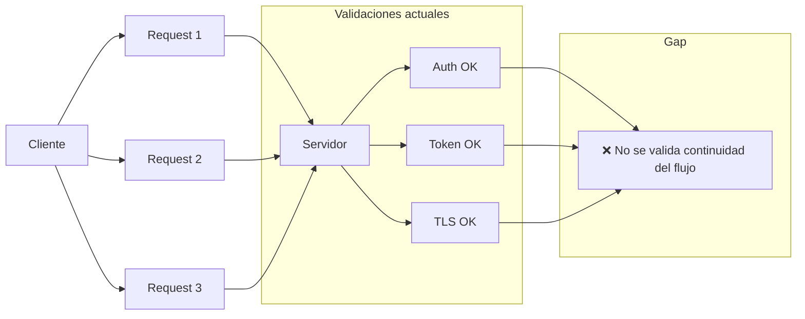
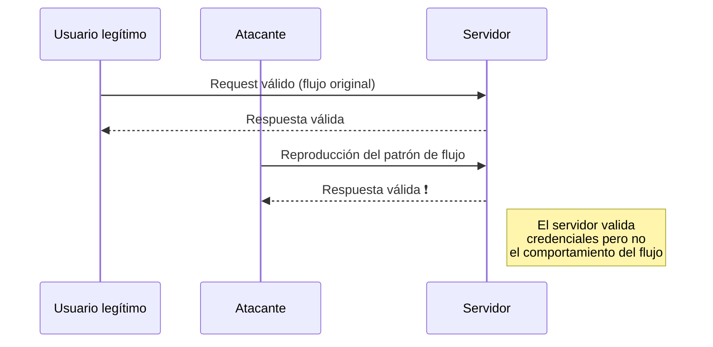
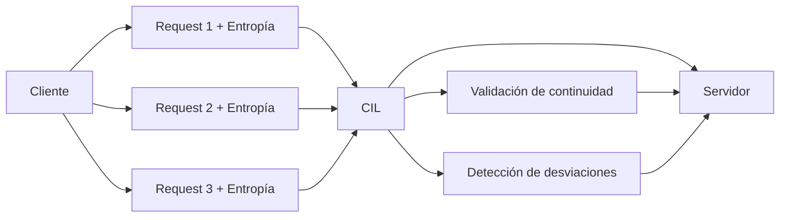

> ℹ️ **Note:** This document is written in Spanish. You can use your browser to translate it into English.  
> The Spanish version is preserved intentionally as part of the project's authorship and intellectual identity.  

# Análisis Transversal de Brechas entre Estándares (*Cross-Standard Gap Analysis*) — CIL (*Communication Integrity Layer*)

**Autor:** Fernando Flores Alvarado  
**Proyecto Original:** RHC Protocol Core — (Randomized Header Channel)  
**Proyecto OWASP:** Randomized Header Channel for CSRF Protection (RHC)  
**Licencia:** CC BY 4.0 (documentación)  
Información detallada sobre versiones, fechas, estado y metadatos completos, consulta [`VERSION.md`](../VERSION.md).  

---

## Introducción

El análisis realizado sobre múltiples estándares de verificación de seguridad de OWASP revela un patrón consistente:

> Los estándares actuales validan correctamente componentes individuales de seguridad,  
> pero no validan la continuidad del flujo de comunicación como una entidad completa.

Esta brecha se vuelve más evidente al comparar:

- OWASP ASVS (aplicaciones web)
- OWASP MASVS (aplicaciones móviles)
- OWASP AIVSS (sistemas de inteligencia artificial)

Cada uno cubre capas específicas de seguridad, pero ninguno introduce explícitamente un modelo de:

> **verificación de continuidad del canal de comunicación**

A esta capa se le denomina:

> **CIL — Communication Integrity Layer**

---

## Patrón común entre estándares

A pesar de sus diferencias estructurales, los tres estándares comparten un enfoque similar:

| Estándar | Qué valida correctamente | Qué no valida |
|---|---|---|
| ASVS | Tokens, sesiones, TLS, APIs, arquitectura | Continuidad del flujo entre requests |
| MASVS | Canal seguro, autenticación móvil, pinning, resiliencia | Coherencia del patrón cliente–backend |
| AIVSS | Outputs, orquestación de agentes, monitoreo, supervisión | Integridad del canal multi-turno entre agentes |

Esto implica que:

> **La seguridad se evalúa de forma estática o por evento, no como secuencia dinámica**

---

## Definición de la brecha estructural

La brecha identificada puede definirse como:

> La ausencia de mecanismos para verificar que una secuencia de comunicación
> mantiene coherencia, continuidad e integridad a lo largo del tiempo

En términos prácticos, esto significa que:

- Los sistemas validan requests individuales  
- Validan identidad, autenticación y autorización  
- Validan cifrado y transporte seguro  

Pero:

- No validan la relación entre requests consecutivos  
- No validan patrones de comportamiento  
- No detectan replicación estructural de flujos legítimos  

---

### 📊 Figura 1 — Brecha estructural (ANTES vs DESPUÉS)

> Validaciones individuales ≠ continuidad del flujo

> El modelo muestra cómo los estándares actuales validan controles individuales sin establecer relación entre requests consecutivos.

---

## Manifestación de la brecha: FCHA

El ataque **FCHA (Flow Channel Hijacking Attack)** explota directamente esta limitación.

Consiste en:

> La reutilización o replicación de un flujo de comunicación legítimo  
> sin necesidad de comprometer credenciales, cifrado o controles de acceso

Este tipo de ataque es posible porque:

- La identidad es válida  
- El canal está cifrado  
- Los controles individuales se cumplen  

Pero:

- El sistema no valida si el flujo completo es legítimo  

---

### ⚠️ Figura 2 — Flow Channel Hijacking Attack (FCHA)

> Muestra la contribución directamente.

> La representación visual del flujo permite observar cómo un patrón legítimo puede ser replicado sin comprometer controles individuales de seguridad.

---

## CIL como capa transversal

Para abordar esta brecha, se introduce:

> **CIL — Communication Integrity Layer**

CIL propone una nueva capa de verificación:

- Validación de continuidad del flujo  
- Introducción de entropía dinámica por interacción  
- Detección de desviaciones en patrones de comunicación  
- Evaluación del canal como sistema, no como eventos aislados  

---

### 🛡️ Figura 3 — Capa CIL (Communication Integrity Layer)

> La solución, cerrando el argumento completo.

> El modelo conceptual presentado muestra cómo CIL introduce verificación de continuidad del flujo como una capa transversal complementaria a los mecanismos tradicionales de seguridad.

---

## Relación de CIL con los estándares

CIL no reemplaza los estándares existentes.

Opera como una capa complementaria transversal:

| Estándar | Extensión aportada por CIL |
|---|---|
| ASVS | Extiende la seguridad de sesión hacia la coherencia del flujo |
| MASVS | Extiende la seguridad móvil hacia la validación del patrón de comunicación |
| AIVSS | Extiende la seguridad de los sistemas multi-agente hacia la integridad del canal multi-turno |

Esto redefine la seguridad desde:

> "componentes seguros"

hacia:

> **"sistemas que se comportan de forma coherente a lo largo del tiempo"**

---

## Implicaciones

La ausencia de CIL implica que:

- Sistemas seguros a nivel de control pueden ser vulnerables a nivel de flujo  
- Ataques sin explotación directa (como FCHA) se vuelven viables  
- La automatización maliciosa reduce su costo operativo  

La introducción de CIL:

- Incrementa el costo de ataque  
- Reduce la viabilidad de explotación masiva  
- Introduce una nueva capa de observabilidad del sistema  

---

## Conclusión

El análisis cruzado demuestra que:

> Existe una brecha estructural consistente en múltiples estándares de seguridad

Esta brecha no corresponde a una implementación incorrecta, sino a una:

> **capa no modelada en los estándares actuales**

CIL propone cubrir esta capa mediante la verificación de:

> **la continuidad del canal de comunicación**

---

## Declaración de posicionamiento

RHC (Randomized Header Channel) implementa la capa CIL como un mecanismo práctico que:

- No reemplaza autenticación, autorización ni cifrado  
- No contradice los estándares existentes  
- Extiende la seguridad hacia la capa del flujo de comunicación  

En este contexto, RHC se posiciona como:

> **una capa complementaria transversal para la verificación de integridad del canal en sistemas modernos**

---
**© 2025 Fernando Flores Alvarado — RHC Protocol Core**  
Publicado bajo [Creative Commons BY 4.0](../LICENSE_CC.md).

> *"Compartir con responsabilidad es inspirar para construir el futuro."*
