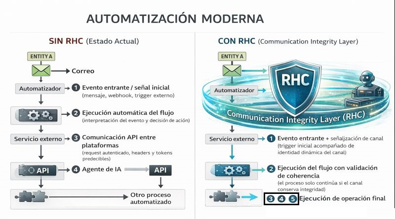
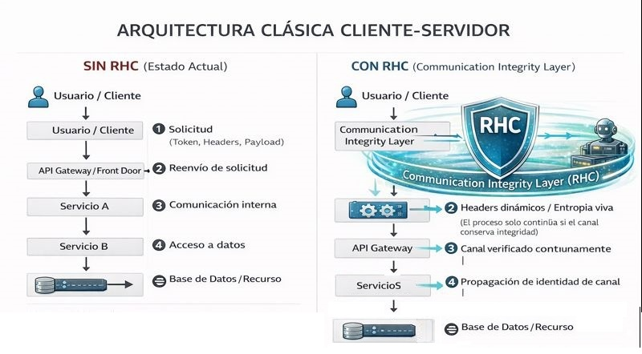

> ℹ️ **Note:** This document is written in Spanish. You can use your browser to translate it into English.  
> The Spanish version is preserved intentionally as part of the project's authorship and intellectual identity.

# Escenarios Arquitectónicos Ilustrativos — Integridad Dinámica del Canal de Comunicación

**Autor:** Fernando Flores Alvarado  
**Proyecto Original:** RHC Protocol Core — (Randomized Header Channel)  
**Proyecto OWASP:** Randomized Header Channel for CSRF Protection (RHC)  
**Licencia:** CC BY 4.0 (documentación)  

Información detallada sobre versiones, fechas, estado y metadatos completos, consulta [`VERSION.md`](../VERSION.md).

---

## Propósito del documento

Este documento complementa [`paradigm-shift.md`](./paradigm-shift.md) presentando escenarios arquitectónicos ilustrativos donde la integridad dinámica del canal de comunicación se vuelve observable en la práctica.

Los escenarios mostrados aquí son conceptuales y educativos. Su objetivo es ayudar a visualizar cómo la confianza implícita se acumula dentro de sistemas distribuidos modernos y cómo RHC introduce integridad dinámica dentro del flujo de comunicación.

Los ejemplos están intencionalmente desacoplados de tecnologías específicas y se enfocan en:

- Comportamiento del flujo
- Continuidad de comunicación
- Validación contextual
- Coherencia temporal
- Integridad del canal

No representan implementaciones cerradas ni arquitecturas obligatorias.

---

# Escenario 1 — Automatización moderna y sistemas inteligentes encadenados

## Contexto

Este escenario representa un flujo automatizado donde múltiples sistemas reaccionan a un evento inicial y encadenan acciones sin intervención humana directa.

Flujo conceptual:

```text
Correo → Automatizador → Servicio → IA → API → Otro proceso
```

Este modelo es ampliamente utilizado actualmente en:

- Automatización empresarial
- Integraciones entre plataformas
- Sistemas orientados a eventos
- Flujos basados en webhooks
- Agentes de IA operando sobre APIs
- Orquestación de procesos autónomos y semiautónomos

A continuación se muestra una comparación conceptual entre un flujo tradicional y un flujo protegido mediante integridad dinámica del canal.


> Figura 1 — Comparación ilustrativa entre flujo tradicional y flujo con integridad dinámica del canal.

---

## Arquitectura SIN RHC (Estado actual)

En el modelo tradicional, cada componente asume que la comunicación previa ya fue validada correctamente.

Cada salto dentro del flujo hereda confianza implícita.

### Comportamiento observable

Cada comunicación asume que:

- El mensaje es legítimo
- El flujo sigue siendo válido
- El contexto no ha sido alterado
- La secuencia continúa siendo coherente

Sin embargo, esta confianza es acumulativa y rara vez es revalidada dinámicamente.

### Consecuencias estructurales

En ausencia de integridad dinámica del canal:

- Un flujo completo puede ser clonado
- Un patrón de comunicación puede repetirse
- Las secuencias pueden ser imitadas
- Los procesos pueden ejecutarse fuera de su intención original
- Un atacante puede insertarse silenciosamente dentro de la conversación

El sistema valida:

- Credenciales
- Tokens
- Endpoints
- Formatos

Pero no valida:

- Cómo llegó el flujo hasta ese punto
- Si el comportamiento sigue siendo coherente
- Si la conversación mantiene continuidad legítima

⚠️ El sistema valida quién envía la solicitud, pero no valida cómo llegó hasta ahí.

---

## Arquitectura CON RHC (Communication Integrity Layer)

Con la introducción de RHC, el flujo deja de depender únicamente de validaciones estáticas.

El evento inicial establece una identidad dinámica del canal que se conserva y revalida continuamente a lo largo de toda la comunicación.

### Comportamiento observable

Cada salto dentro del flujo:

- Introduce entropía contextual
- Verifica coherencia temporal
- Revalida continuidad comunicacional
- Condiciona la ejecución al comportamiento del flujo
- Detecta repeticiones e inconsistencias

La comunicación deja de ser únicamente una secuencia de requests válidos.

Se convierte en un canal vivo verificable en el tiempo.

### Qué NO cambia

RHC no reemplaza:

- TLS
- OAuth
- JWT
- AuthN
- AuthZ
- APIs existentes

La arquitectura base permanece intacta.

Lo que cambia es el modelo de confianza.

### Resultado conceptual

Con integridad dinámica del canal:

- Los flujos inválidos se rompen automáticamente
- La suplantación contextual se vuelve detectable
- El canal deja de aceptar imitaciones
- La comunicación deja una evidencia viva y verificable

✅ “El atacante puede copiar credenciales, pero no puede reconstruir el canal.”

---

# Escenario 2 — Arquitectura clásica cliente-servidor y microservicios

## Contexto

Este escenario representa uno de los modelos más comunes en arquitecturas modernas:

Flujo conceptual:

```text
Solicitud → Gateway → Servicios → Datos
```

Un cliente realiza una solicitud que atraviesa un punto de entrada y posteriormente se propaga entre múltiples servicios internos hasta acceder a recursos o datos.

Este patrón es ampliamente utilizado en:

- Microservicios
- APIs empresariales
- Plataformas cloud-native
- Sistemas distribuidos tradicionales
- Gateways y balanceadores modernos

A continuación se muestra una comparación conceptual entre una arquitectura tradicional y una arquitectura con integridad dinámica del canal.


> Figura 2 — Comparación ilustrativa entre flujo tradicional y flujo con integridad dinámica del canal.

---

## Arquitectura SIN RHC (Estado actual)

En arquitecturas tradicionales, cada componente confía en que el componente anterior validó correctamente la petición.

La validación suele enfocarse en:

- Tokens
- Sesiones
- Headers
- Permisos
- Identidad

### Características estructurales

En este modelo:

- El token permanece relativamente estático
- Los headers suelen ser predecibles
- Cada salto hereda confianza implícita
- No existe memoria contextual del canal
- El sistema valida estados puntuales, no continuidad dinámica

### Riesgos estructurales

La debilidad no surge necesariamente de una vulnerabilidad aislada.

Surge del modelo de confianza acumulativa.

Esto habilita escenarios como:

- Ataques de repetición
- Secuestro de sesión
- Movimiento lateral
- Reutilización de patrones válidos
- Suplantación contextual del flujo

El sistema valida:

> “Quién eres”

Pero no valida:

> “Cómo llegaste aquí”

⚠️ El sistema protege los componentes, pero no protege la trayectoria de la comunicación.

---

## Arquitectura CON RHC (Communication Integrity Layer)

Con RHC, la solicitud inicial no solo transporta credenciales.

También establece una identidad dinámica del canal derivada de una semilla contextual de entropía (*Entropy Seed*), que evoluciona durante toda la conversación.

### Comportamiento observable

Con integridad dinámica del canal:

- Los headers dejan de ser estáticos
- El canal se verifica continuamente
- La identidad contextual se propaga entre servicios
- Cada salto revalida coherencia temporal y semántica
- La ejecución depende del comportamiento legítimo del flujo

La validación deja de depender únicamente de autenticación puntual.

Ahora depende también de continuidad contextual verificable.

### Qué NO cambia

RHC no reemplaza:

- TLS
- OAuth
- JWT
- Gateways
- APIs
- Sistemas existentes

La infraestructura sigue funcionando normalmente.

Lo que cambia es la lógica de validación del flujo.

### Resultado conceptual

Con RHC:

- Los flujos inconsistentes se rompen automáticamente
- La incoherencia comunicacional se vuelve detectable
- Cada salto revalida el comportamiento del canal
- La comunicación deja evidencia verificable en el tiempo

✅ “El atacante puede copiar credenciales, pero no puede reconstruir el canal.”

---

# Observación conceptual

Estos escenarios no intentan describir una implementación específica de RHC.

Su propósito es visualizar el cambio de paradigma:

Antes:

```text
Proteger sistemas
```

Ahora:

```text
Proteger la comunicación entre sistemas
```

La diferencia fundamental no es únicamente tecnológica.

Es estructural.

La seguridad deja de enfocarse exclusivamente en identidad y acceso, y comienza a incorporar continuidad, coherencia e integridad dinámica del flujo comunicacional.

---

# Relación con FCHA

Los escenarios anteriores representan entornos donde el patrón descrito como:

**Flow Channel Hijacking Attack (FCHA)**

puede emerger de forma natural cuando:

- Los sistemas confían implícitamente en el flujo
- Las validaciones son únicamente estáticas
- El comportamiento del canal no es verificado dinámicamente
- Las secuencias legítimas pueden ser imitadas

RHC introduce una capa complementaria orientada precisamente a reducir esa superficie de exposición.

---

# Documento relacionado

Ver documento principal:

- [`paradigm-shift.md`](./paradigm-shift.md)

---

## Autor y licencia

Contribuido por: **Fernando Flores Alvarado**  
Contacto: fernandofa0306@gmail.com

Este contenido se publica bajo la  
**Licencia Creative Commons Atribución 4.0 Internacional (CC BY 4.0)**.

Eres libre de compartirlo o adaptarlo siempre que se otorgue la atribución adecuada.

---

**© 2025 Fernando Flores Alvarado — RHC Protocol Core**  
Publicado bajo [Creative Commons BY 4.0](../LICENSE_CC.md).

> *“Compartir con responsabilidad es inspirar para construir el futuro.”*